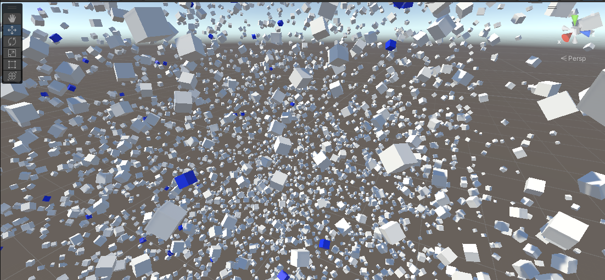

# Matrix Offset Matching (Unity3D Test Task)

## Описание задачи

Дано два набора матриц `4×4` в формате JSON:

- **model.json** — 100 матриц (модель)
- **space.json** — 5000 матриц (пространство)

### Требуется:

1. Оценить время решения задачи
2. Реализовать функцию нахождения всех возможных смещений матриц модели таким образом, что она полностью
   совпадёт с матрицами пространства
3. Визуализировать алгоритм поиска
4. Экспортировать найденные смещения в JSON
5. Реализовать решение в **Unity3D** и опубликовать в Git

---

## Оценка времени выполнения

| Этап                                   | Время             |
| -------------------------------------- |-------------------|
| Анализ задания и формата данных        | 0.5 ч             |
| Парсинг JSON и структуры данных        | 0.5 ч             |
| Реализация алгоритма поиска смещений   | 1.5-2 ч           |
| Визуализация алгоритма в Unity         | 1-1.5 ч           |
| Экспорт результата в JSON              | 0.5 ч             |
| Подготовка Git-репозитория + README    | 0.5 ч             |
| **Итого**                              | **4.5–5.5 часов** |


---

## Идея и алгоритм решения

### Формальная постановка

Пусть:

- `Mᵢ` — матрицы модели
- `T` — искомая матрица смещения

Необходимо найти все такие `T`, что:

```
∀ Mᵢ ∈ model, T × Mᵢ ∈ space
```

Сравнение выполняется с учётом допуска по `float`.

---

### Основная идея алгоритма

1. Выбирается **опорная матрица** модели `M₀`
2. Для каждой матрицы пространства `Sⱼ` вычисляется кандидат смещения:

```
T = Sⱼ × inverse(M₀)
```

3. Полученная матрица `T` применяется ко всем остальным матрицам модели
4. Проверяется, что каждая трансформированная матрица присутствует в пространстве
5. Если совпали **все 100 матриц модели**, смещение считается валидным

---

### Сравнение матриц

Прямое сравнение `Matrix4x4` невозможно из-за погрешностей вычислений с плавающей точкой.

Поэтому сравнение выполняется покомпонентно с заданным допуском `epsilon`.

---

## Проверка корректности

Корректность решения подтверждается следующими проверками:

- для каждого найденного смещения совпадают **все 100 матриц модели**
- отсутствие частичных совпадений
- устойчивость результата при изменении `epsilon` в разумных пределах
- визуальное подтверждение корректности в сцене Unity

---

## Реальные результаты

В результате работы алгоритма было найдено:

- **20 валидных матриц смещения при epsilon=0.001**

Каждая из них полностью переводит модель в подмножество матриц пространства.

Найденные смещения экспортируются в файл:

```
Assets/result_offsets.json
```

---

## Визуализация

Для визуализации алгоритма реализован отдельный компонент `Visualizer`:

- пространство отображается статически
- модель пошагово трансформируется каждой найденной матрицей смещения
- между шагами используется задержка для наглядности
- визуализация учитывает **и позицию, и ориентацию** объектов



---
